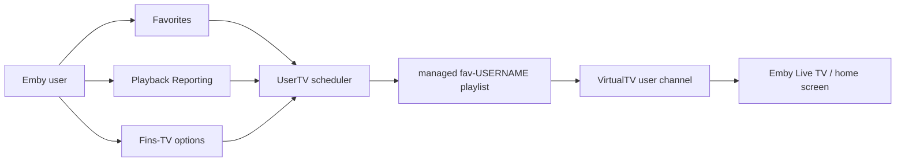

# Emby UserTV Stream

**Personal 24/7 TV channels generated from Emby favorites, viewing behavior and VirtualTV.**

Emby UserTV Stream is experimental documentation and an operations blueprint for a private Emby setup that creates one managed playlist and one VirtualTV live channel per active user. Regular Emby favorites, manually selected Fins-TV options and recently watched series become continuous, personal TV rotations.

> **Experimental status:** This project documents private experiments. There is no warranty, no support commitment and no promise that it works in other Emby installations. Use it only with backups, dry-runs and your own risk review.

> **No commercial use:** Commercial use of the intellectual property, concepts, workflows, diagrams, documentation or derivative implementations is not allowed without prior written permission. See [LICENSE.md](LICENSE.md).

[Deutsche Version](README.md)

## Why this matters

Large media libraries are useful, but sometimes users simply want to turn something on and immediately get content that fits their taste. Emby UserTV Stream connects personal user signals with a TV-like lean-back experience:

- **One live channel per user:** channels such as `viewer-a Channel`, `viewer-b Channel` and `viewer-c Channel` are generated from individual data.
- **Favorites become rotation seeds:** favorite movies and shows are transformed into managed playlists.
- **Shows can continue naturally:** recently watched shows can be detected as hot series and scheduled from the next useful episode.
- **24/7 programming:** the scheduler builds a multi-hour program window and refreshes it regularly.
- **VirtualTV integration:** generated playlists become VirtualTV channels that appear like Live TV.
- **Safety boundaries:** manual channels and unmanaged media are not touched; backups and dry-runs are part of the workflow.

## Quick visual impression

## Start here

- [Build and test the standalone plugin](docs/en/plugin-standalone.md)
- [Installation and quickstart](docs/en/installation-quickstart.md)
- [Feature overview](docs/en/features.md)
- [Architecture](docs/en/architecture.md)
- [Operations](docs/en/operations.md)
- [German installation and quickstart](docs/de/installation-quickstart.md)

## Standalone Plugin

The repository now contains an installable Emby plugin foundation in `src/Emby.UserTV.Plugin`. It does not fully replace the server-local cron jobs yet, but it already provides a plugin entry point, admin page, configuration, favorite scanning, and dry-run planning in a standalone Emby DLL.

## In-depth Articles

1. [Problem and product idea](docs/en/articles/01-problem-and-product-idea.md)
2. [Data sources and user signals](docs/en/articles/02-data-sources-and-user-signals.md)
3. [Scheduler and 24/7 programming](docs/en/articles/03-scheduler-and-programming.md)
4. [VirtualTV integration](docs/en/articles/04-virtualtv-integration.md)
5. [Safety model and boundaries](docs/en/articles/05-safety-model.md)
6. [Operations model with systemd timer](docs/en/articles/06-operations-model.md)

German articles:

1. [Problem und Produktidee](docs/de/articles/01-problem-und-produktidee.md)
2. [Datenquellen und Benutzer-Signale](docs/de/articles/02-datenquellen-und-benutzersignale.md)
3. [Scheduler und 24/7-Programmplanung](docs/de/articles/03-scheduler-und-programmplanung.md)
4. [VirtualTV-Integration](docs/de/articles/04-virtualtv-integration.md)
5. [Sicherheitsmodell und Grenzen](docs/de/articles/05-sicherheitsmodell.md)
6. [Betriebsmodell mit systemd-Timer](docs/de/articles/06-betriebsmodell.md)

## Workflow at a glance

## What gets generated

| Area | Example | Purpose |
| --- | --- | --- |
| Playlist | `fav-viewer-a`, `fav-viewer-b`, `fav-viewer-c` | Sorted, managed source list per user |
| VirtualTV channel | `UserTV - viewer-b Channel` | Live TV entry point per user |
| State file | `/var/lib/emby-favtv-sync/state.json` | Stores schedules, IDs and previous runs |
| Options file | `/var/lib/emby-favtv-sync/options.json` | Stores per-user channel options |
| systemd timer | `emby-favtv-sync.timer` | Refreshes generated channels regularly |

## What it is not

- Not an official Emby plugin.
- Not guaranteed to be production-safe.
- Not a replacement for backups.
- Not legal advice.
- Not permission for commercial use.

## Documentation scope

This documentation describes the observed local `emby-favtv-sync` project, its Emby program-data artifacts and the intended workflow. Private configuration values, API keys, tokens and personal secrets do not belong in this repository.
