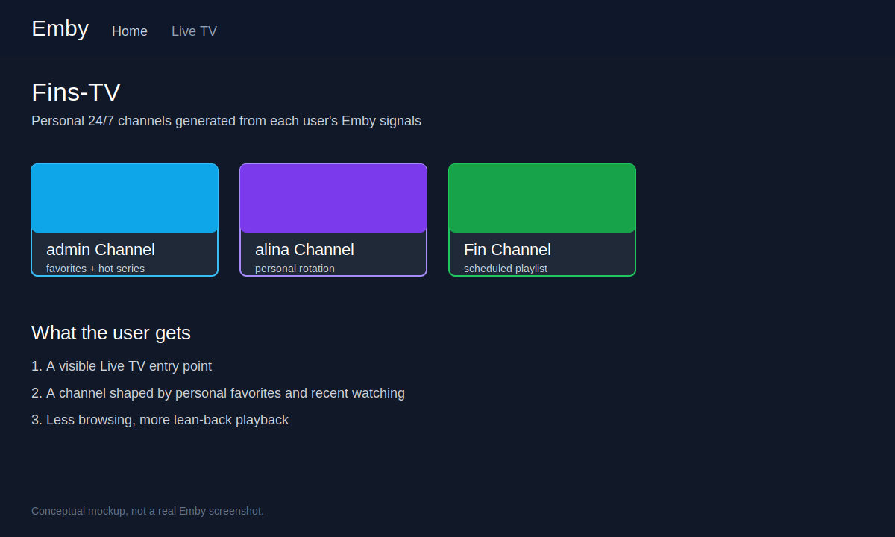
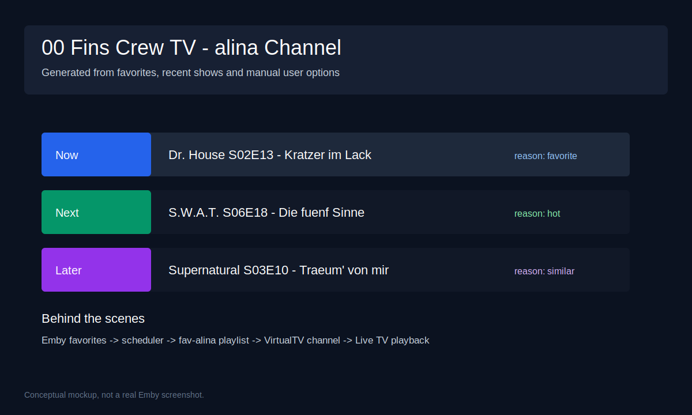
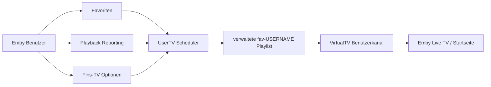

# Emby UserTV Stream

**Personalisierte 24/7-TV-Kanäle aus Emby-Favoriten, Sehgewohnheiten und VirtualTV.**

Emby UserTV Stream ist eine experimentelle Dokumentation und Betriebsvorlage fuer ein privates Emby-Setup, das pro aktivem Benutzer automatisch eine eigene Playlist und daraus einen VirtualTV-Live-Kanal erzeugt. Aus normalen Emby-Favoriten, manuell gesetzten Fins-TV-Optionen und zuletzt geschauten Serien entstehen kontinuierliche, persoenliche TV-Rotationen.

> **Experimenteller Status:** Dieses Projekt beschreibt private Experimente. Es gibt keine Garantie, keinen Support-Anspruch und keine Zusicherung, dass es in anderen Emby-Installationen funktioniert. Produktive Nutzung nur mit Backups, Testlauf und eigener Verantwortung.

> **Keine kommerzielle Nutzung:** Kommerzielle Nutzung des geistigen Eigentums, der Konzepte, Workflows, Diagramme, Dokumentation oder darauf basierender Implementierungen ist ohne vorherige schriftliche Genehmigung nicht erlaubt. Details stehen in [LICENSE.md](LICENSE.md).

[English version](README.en.md)

## Warum das nuetzlich ist

Viele Mediatheken sind gross, aber der Alltag ist simpel: Man moechte einschalten und sofort etwas sehen, das zum eigenen Geschmack passt. Emby UserTV Stream verbindet die persoenlichen Signale eines Benutzers mit einer TV-artigen Lean-back-Erfahrung:

- **Pro Benutzer ein eigener Live-Kanal:** `admin Channel`, `alina Channel`, `Fin Channel` und weitere Kanaele entstehen aus individuellen Daten.
- **Favoriten werden zur Rotation:** Filme und Serien-Favoriten werden in eine verwaltete Playlist ueberfuehrt.
- **Serien werden fortgesetzt:** Zuletzt geschaute Serien koennen als "hot series" erkannt und ab der passenden Folge weitergespielt werden.
- **24/7-Planung:** Der Scheduler baut ein mehrstuendiges Programmfenster und erneuert es regelmaessig.
- **VirtualTV-Integration:** Die erzeugten Playlists werden als VirtualTV-Kanaele sichtbar und koennen wie Live TV genutzt werden.
- **Sicherheitsgrenzen:** Manuelle Kanaele und nicht verwaltete Medien bleiben unangetastet, Backups und Dry-Runs sind Teil des Workflows.

## Schneller Eindruck

## Startpunkte

- [Installation und Quickstart auf Deutsch](docs/de/installation-quickstart.md)
- [Installation and quickstart in English](docs/en/installation-quickstart.md)
- [Funktionsuebersicht DE](docs/de/features.md)
- [Feature overview EN](docs/en/features.md)
- [Architektur DE](docs/de/architecture.md)
- [Architecture EN](docs/en/architecture.md)
- [Betrieb und Wartung DE](docs/de/operations.md)
- [Operations EN](docs/en/operations.md)

## Fachartikel im Hintergrund

Die Startseite ist bewusst werblicher und kompakter. Die technischen Details liegen in den Fachartikeln:

1. [Problem und Produktidee](docs/de/articles/01-problem-und-produktidee.md)
2. [Datenquellen und Benutzer-Signale](docs/de/articles/02-datenquellen-und-benutzersignale.md)
3. [Scheduler und 24/7-Programmplanung](docs/de/articles/03-scheduler-und-programmplanung.md)
4. [VirtualTV-Integration](docs/de/articles/04-virtualtv-integration.md)
5. [Sicherheitsmodell und Grenzen](docs/de/articles/05-sicherheitsmodell.md)
6. [Betriebsmodell mit systemd-Timer](docs/de/articles/06-betriebsmodell.md)

English background articles:

1. [Problem and product idea](docs/en/articles/01-problem-and-product-idea.md)
2. [Data sources and user signals](docs/en/articles/02-data-sources-and-user-signals.md)
3. [Scheduler and 24/7 programming](docs/en/articles/03-scheduler-and-programming.md)
4. [VirtualTV integration](docs/en/articles/04-virtualtv-integration.md)
5. [Safety model and boundaries](docs/en/articles/05-safety-model.md)
6. [Operations model with systemd timer](docs/en/articles/06-operations-model.md)

## Ablauf in einem Bild

## Was erzeugt wird

| Bereich | Beispiel | Zweck |
| --- | --- | --- |
| Playlist | `fav-admin`, `fav-alina`, `fav-Fin` | Sortierte, verwaltete Quellen pro User |
| VirtualTV-Kanal | `00 Fins Crew TV - alina Channel` | Live-TV-Einstiegspunkt pro User |
| State-Datei | `/var/lib/emby-favtv-sync/state.json` | Merkt Zeitplan, IDs und letzte Laeufe |
| Options-Datei | `/var/lib/emby-favtv-sync/options.json` | Speichert User-spezifische Kanaloptionen |
| systemd-Timer | `emby-favtv-sync.timer` | Aktualisiert die Kanaele regelmaessig |

## Was es nicht ist

- Kein offizielles Emby-Plugin.
- Keine Garantie fuer produktive Stabilitaet.
- Kein Ersatz fuer Backups.
- Keine Rechtsberatung fuer Lizenz- oder Nutzungsfragen.
- Keine Erlaubnis zur kommerziellen Nutzung ohne vorherige Genehmigung.

## Dokumentationsumfang

Diese Dokumentation beschreibt das beobachtete lokale Projekt `emby-favtv-sync`, seine Emby-Programmdaten-Artefakte und den beabsichtigten Workflow. Private Konfigurationswerte, API-Keys, Tokens und persoenliche Secrets gehoeren nicht in dieses Repository.
