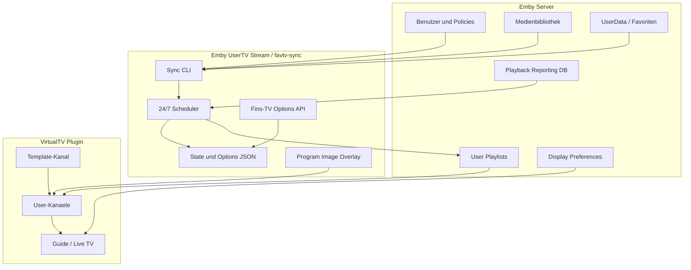
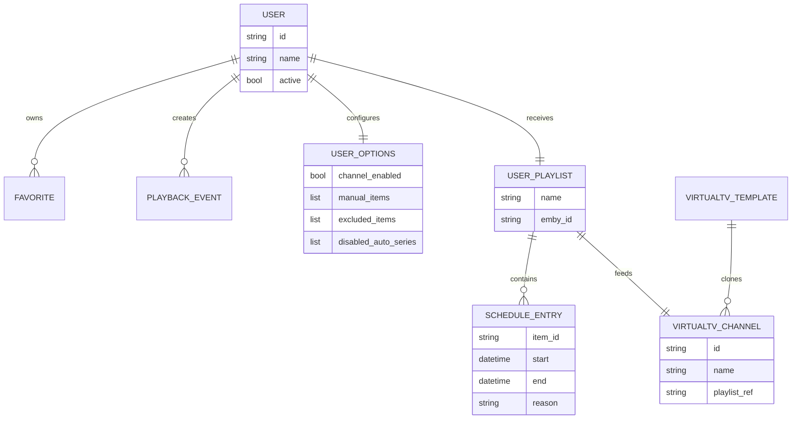
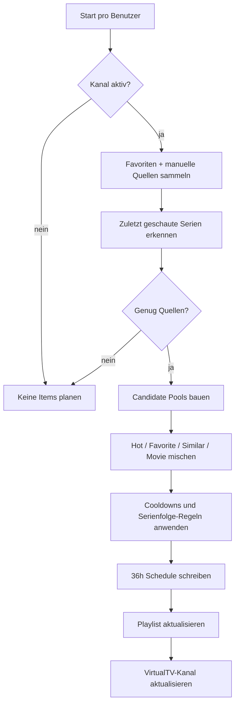

# Architektur

Ein externes Python-Werkzeug liest Emby-Daten, berechnet pro Benutzer eine Rotation, schreibt verwaltete Playlists und aktualisiert VirtualTV-Kanaele.

## Komponenten

## Hauptpfad

1. Aktive Emby-Benutzer werden ueber die Emby API gelesen.
2. Fuer jeden Benutzer werden Favoriten geladen.
3. Serien-Favoriten werden in Episoden aufgeloest.
4. Manuelle Fins-TV-Optionen werden ergaenzt.
5. Playback Reporting liefert aktuelle Serieninteressen.
6. Der Scheduler baut eine zeitliche Rotation.
7. Die Zielreihenfolge wird in `fav-USERNAME` geschrieben.
8. VirtualTV-Kanaele werden erstellt oder aktualisiert.
9. Emby Live TV zeigt die Kanaele.

## Datenmodell

## Scheduler-Entscheidung

## Sicherheitsgrenzen

- Nicht verwaltete VirtualTV-Kanaele bleiben unberuehrt.
- Verwaltete Objekte sind ueber Namen, State und Template-Bezug erkennbar.
- Vor VirtualTV-Schreibzugriffen werden Backups angelegt.
- Dry-run ist Standard-Sicherheitsmodus in der Beispielkonfiguration.
- Private API-Keys und produktive Konfigurationen gehoeren nicht ins Repository.
