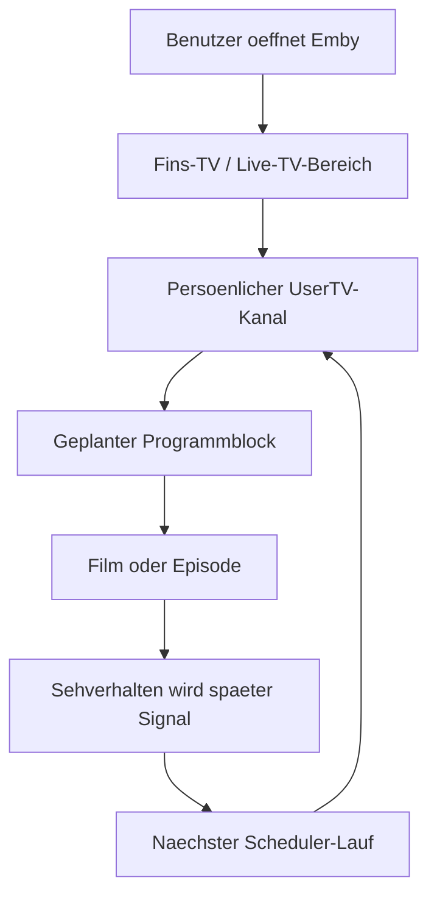

# Funktionsvielfalt und Mehrwert

Emby UserTV Stream kombiniert mehrere Einzelideen zu einem persoenlichen Live-TV-Erlebnis. Der Mehrwert entsteht nicht aus einem einzelnen Feature, sondern aus der Kette von Benutzer-Signal, Planung, Playlist, VirtualTV-Kanal und Emby-Oberflaeche.

## Kernfunktionen

| Funktion | Nutzen fuer Benutzer | Technischer Kern |
| --- | --- | --- |
| Pro-User-Playlist | Jeder Benutzer bekommt eine eigene Rotation | `fav-USERNAME` Playlist |
| Pro-User-Live-Kanal | Ein persoenlicher Kanal erscheint in Live TV | VirtualTV-Kanal aus Template |
| Favoriten-Sync | Bereits gepflegte Emby-Favoriten werden nutzbar | Emby API `Filters=IsFavorite` |
| Serien-Aufloesung | Serien-Favoriten werden zu Episodenfolgen | Emby Shows/Episodes API |
| Auto-Rotation | Zuletzt geschautes wird als aktuelles Interesse erkannt | Playback Reporting DB |
| 24/7-Scheduler | Es entsteht ein echtes Programmraster | State-basierte Planung |
| Aehnliche Inhalte | Der Kanal erweitert sich ueber passende lokale Medien | Genre/Tags/People/Studios/Rating/Jahr |
| Cooldowns | Wiederholungen werden reduziert | Movie- und Episode-Cooldown |
| Fins-TV Optionen | Nutzer koennen manuell steuern | Options-API und `options.json` |
| Programmbilder | Kanal wirkt in Emby sichtbarer | Bild-Overlay via FFmpeg |
| Home-Integration | Fins-TV kann auf der Startseite sichtbar sein | Display Preferences |
| Timer-Betrieb | Aktualisierung ohne manuelles Starten | `emby-favtv-sync.timer` |

## Benutzermehrwert

### Einschalten statt suchen

Der persoenliche Kanal nimmt dem Benutzer die Entscheidung ab. Statt durch Filme und Serien zu scrollen, startet ein Kanal, der aus persoenlichen Signalen gebaut wurde.

### Bibliothek wird aktiver genutzt

Viele lokale Medienbibliotheken enthalten gute Inhalte, die selten ausgewaehlt werden. Der Scheduler kann passende Filme und Episoden wieder sichtbar machen.

### Serien bleiben im Fluss

Wenn ein Benutzer mehrere Folgen einer Serie gesehen hat, erkennt das System diese Serie als aktuelles Interesse. Die naechsten passenden Folgen koennen bevorzugt in die Rotation gelangen.

### Jeder Benutzer bekommt andere Kanaele

Die Kanaele sind nicht global, sondern benutzerbezogen. Das macht das System fuer Familien, Wohngemeinschaften oder mehrere Profile interessant.

## Admin-Mehrwert

- Einmaliger VirtualTV-Template-Aufbau statt manueller Kanalpflege pro Benutzer.
- Wiederholbare Checks und Dry-Runs.
- State-Dateien machen Aenderungen nachvollziehbar.
- Backups vor VirtualTV-Aenderungen.
- Timer-Betrieb mit systemd statt unsichtbarer Cron-Magie.

## Grenzen

- Das System ist experimentell.
- Es kann Emby- und VirtualTV-Versionen geben, die anders reagieren.
- Live-TV-Verhalten haengt stark von VirtualTV ab.
- Programmbild-Overlays benoetigen FFmpeg.
- Kommerzielle Nutzung ist ohne Genehmigung nicht erlaubt.

## Feature-Flow

