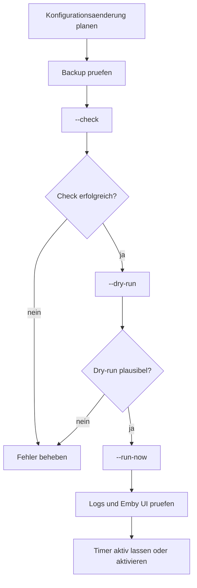

# Betrieb und Wartung

Der produktionsnahe Betrieb sollte konservativ erfolgen. Dieses Projekt kann Playlists, VirtualTV-Kanaele, Home-Preferences und Programmbilder veraendern.

## systemd-Dienste

| Einheit | Aufgabe |
| --- | --- |
| `emby-favtv-sync.service` | Einmaliger Sync-Lauf |
| `emby-favtv-sync.timer` | Wiederholt den Sync, typischerweise alle 12 Stunden |
| `emby-favtv-options.service` | Kleine Options-API fuer Fins-TV-Benutzereinstellungen |

Status:

```bash
systemctl status emby-favtv-sync.service emby-favtv-sync.timer emby-favtv-options.service
```

Naechste Laeufe:

```bash
systemctl list-timers 'emby-favtv*' --all
```

Logs:

```bash
journalctl -u emby-favtv-sync.service -n 200 --no-pager
journalctl -u emby-favtv-options.service -n 200 --no-pager
tail -n 200 /var/log/emby-favtv-sync.log
```

## Empfohlener Aenderungsprozess



## Backups

Vor VirtualTV-Schreibzugriffen sollten Backups unter `/var/lib/emby-favtv-sync/backups/` entstehen. Zusaetzlich sind manuelle Backups sinnvoll fuer:

- `/etc/emby-favtv-sync/config.json`
- `/var/lib/emby-favtv-sync/state.json`
- `/var/lib/emby-favtv-sync/options.json`
- `/var/lib/emby/plugins/configurations/VirtualTV.xml`
- `/var/lib/emby/data/displaypreferences.db`

## Health Checks

Regelmaessig pruefen:

- Timer ist aktiv.
- Letzter Sync endete mit `status=0/SUCCESS`.
- Keine unerwarteten manuellen Kanaele wurden veraendert.
- User-Playlists enthalten plausible Medien.
- VirtualTV zeigt pro User genau die erwarteten Kanaele.
- Emby API-Key ist gueltig, aber nicht in Logs oder Git enthalten.

## Betriebliches Risiko

| Risiko | Gegenmassnahme |
| --- | --- |
| VirtualTV-Konfiguration wird falsch geschrieben | Backup vor jedem Write, Restore-Doku |
| Zu wenig Quellen fuer einen User | `min_items_for_channel`, Favoriten/Optionen pruefen |
| Kanal wiederholt zu viel | Cooldowns und Mix-Pattern anpassen |
| Playback Reporting fehlt | Auto-Rotation deaktivieren oder DB-Pfad korrigieren |
| FFmpeg fehlt | Programmbild-Overlay deaktivieren oder Pfad setzen |
| API-Key kompromittiert | Key sofort rotieren |

## Stoppen

Timer stoppen:

```bash
sudo systemctl disable --now emby-favtv-sync.timer
```

Options-API stoppen:

```bash
sudo systemctl disable --now emby-favtv-options.service
```

Das stoppt zukuenftige Aenderungen, entfernt aber keine bereits erzeugten Playlists oder VirtualTV-Kanaele.
