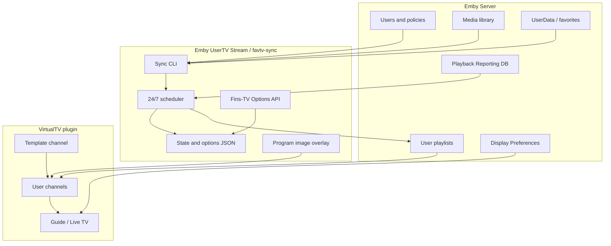
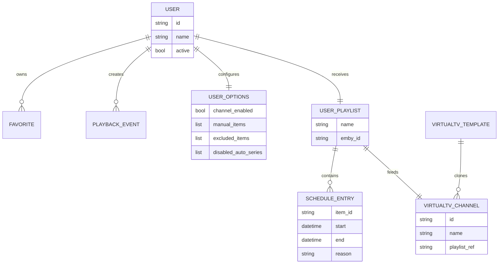
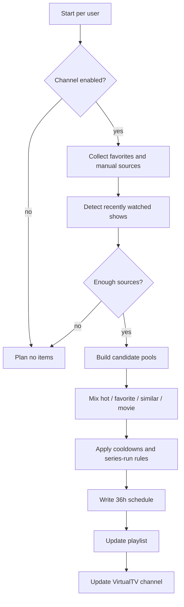

# Architecture

The architecture is intentionally pragmatic: an external Python tool reads Emby data, calculates one rotation per user, writes managed playlists and updates VirtualTV channels.

## Components

## Main path

1. Active Emby users are read through the Emby API.
2. Favorites are loaded for every user.
3. Favorite shows are expanded to episodes.
4. Manual Fins-TV options are added.
5. Playback Reporting provides current show-interest signals.
6. The scheduler builds a time-based rotation.
7. The target order is written to `fav-USERNAME`.
8. VirtualTV channels are created or updated.
9. Emby Live TV displays the channels.

## Data model

## Scheduler decision

## Safety boundaries

- Unmanaged VirtualTV channels are left untouched.
- Managed objects are identifiable through names, state and template relation.
- Backups are created before VirtualTV writes.
- Dry-run is the default safety mode in the sample configuration.
- Private API keys and production configuration files do not belong in the repository.
