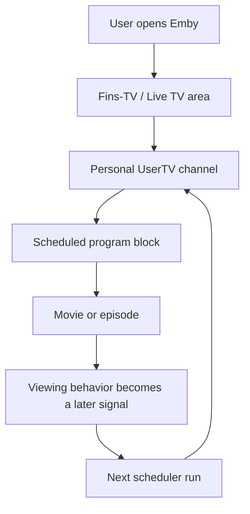

# Feature Set and Value

Emby UserTV Stream combines several ideas into a personal live-TV experience. The value does not come from one feature alone, but from the chain of user signal, scheduling, playlist generation, VirtualTV channel and Emby UI exposure.

## Core features

| Feature | User value | Technical core |
| --- | --- | --- |
| Per-user playlist | Every user gets a personal rotation | `fav-USERNAME` playlist |
| Per-user live channel | A personal channel appears in Live TV | VirtualTV channel cloned from template |
| Favorites sync | Existing Emby favorites become useful | Emby API `Filters=IsFavorite` |
| Show expansion | Favorite shows become episode sequences | Emby Shows/Episodes API |
| Auto rotation | Recently watched content becomes an interest signal | Playback Reporting DB |
| 24/7 scheduler | The channel gets a real program grid | State-based planning |
| Similar content | The channel expands through matching local media | Genres/tags/people/studios/rating/year |
| Cooldowns | Repetition is reduced | Movie and episode cooldowns |
| Fins-TV options | Users can manually steer their channel | Options API and `options.json` |
| Program images | Channels become more visible in Emby | Image overlay via FFmpeg |
| Home integration | Fins-TV can be surfaced on the home screen | Display Preferences |
| Timer operation | Refreshes happen without manual runs | `emby-favtv-sync.timer` |

## User value

### Turn on instead of searching

The personal channel removes the decision burden. Instead of browsing movies and shows, users start a channel built from their own signals.

### The library becomes active again

Large local libraries often contain good content that rarely gets selected. The scheduler can bring matching films and episodes back into view.

### Shows keep flowing

When a user watched multiple episodes of a show, the system can treat that show as current interest. Useful next episodes can be preferred in the rotation.

### Every user gets a different channel

Channels are user-specific, not global. That makes the idea useful for families, shared homes or multi-profile Emby setups.

## Admin value

- One VirtualTV template instead of manual channel maintenance per user.
- Repeatable checks and dry-runs.
- State files make behavior traceable.
- Backups before VirtualTV changes.
- systemd timer operation instead of invisible cron behavior.

## Limits

- The system is experimental.
- Emby and VirtualTV versions may behave differently.
- Live TV behavior depends heavily on VirtualTV.
- Program image overlays require FFmpeg.
- Commercial use is not allowed without permission.

## Feature flow

