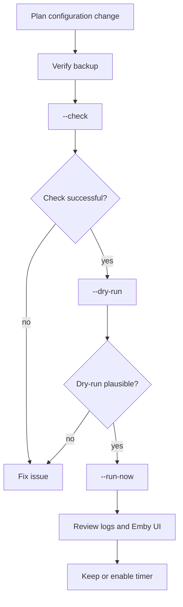

# Operations and Maintenance

Production-adjacent operation should be conservative. This project can change playlists, VirtualTV channels, home preferences and program images.

## systemd units

| Unit | Purpose |
| --- | --- |
| `emby-favtv-sync.service` | One-shot sync run |
| `emby-favtv-sync.timer` | Repeats the sync, typically every 12 hours |
| `emby-favtv-options.service` | Small options API for Fins-TV user settings |

Status:

```bash
systemctl status emby-favtv-sync.service emby-favtv-sync.timer emby-favtv-options.service
```

Upcoming runs:

```bash
systemctl list-timers 'emby-favtv*' --all
```

Logs:

```bash
journalctl -u emby-favtv-sync.service -n 200 --no-pager
journalctl -u emby-favtv-options.service -n 200 --no-pager
tail -n 200 /var/log/emby-favtv-sync.log
```

## Recommended change process



## Backups

Backups should be created under `/var/lib/emby-favtv-sync/backups/` before VirtualTV writes. Additional manual backups are useful for:

- `/etc/emby-favtv-sync/config.json`
- `/var/lib/emby-favtv-sync/state.json`
- `/var/lib/emby-favtv-sync/options.json`
- `/var/lib/emby/plugins/configurations/VirtualTV.xml`
- `/var/lib/emby/data/displaypreferences.db`

## Health checks

Check regularly:

- Timer is active.
- Last sync ended with `status=0/SUCCESS`.
- No unexpected manual channels were changed.
- User playlists contain plausible media.
- VirtualTV shows exactly the expected channels per user.
- Emby API key is valid, but not present in logs or Git.

## Operational risk

| Risk | Mitigation |
| --- | --- |
| VirtualTV configuration is written incorrectly | Backup before every write, documented restore |
| Too few sources for a user | Check `min_items_for_channel`, favorites and options |
| Channel repeats too much | Tune cooldowns and mix pattern |
| Playback Reporting is missing | Disable auto rotation or fix DB path |
| FFmpeg is missing | Disable image overlay or set path |
| API key is compromised | Rotate key immediately |

## Stop

Stop timer:

```bash
sudo systemctl disable --now emby-favtv-sync.timer
```

Stop options API:

```bash
sudo systemctl disable --now emby-favtv-options.service
```

This stops future changes but does not remove already generated playlists or VirtualTV channels.
